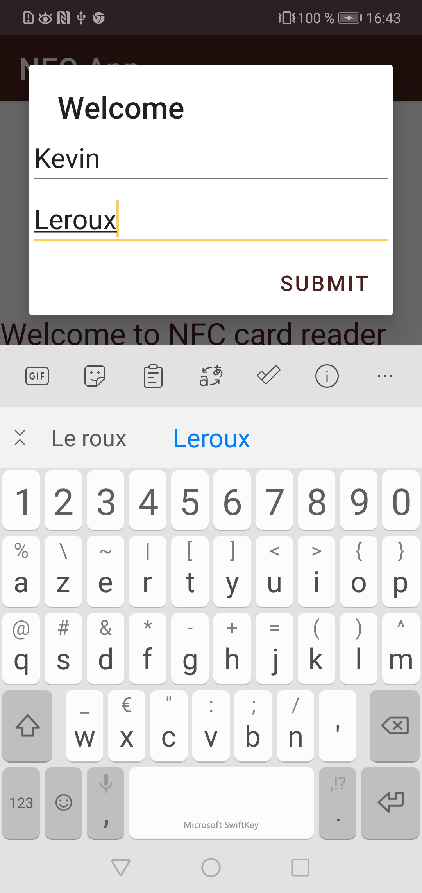
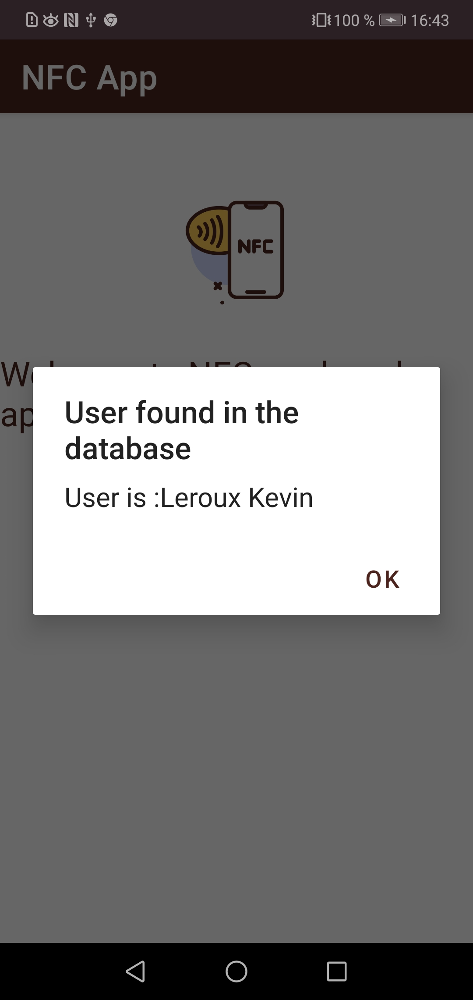
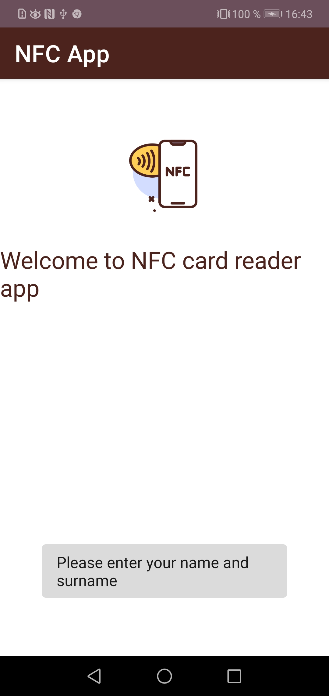
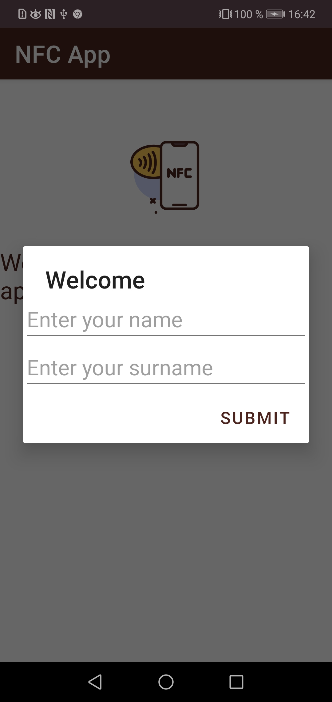

# NFC Project - Android

### Reading NFC cards from Android phone

<table>
    <thead>
        <tr>
            <th width="150px">Year</th>
            <th width="150px">Course</th>
            <th width="300px">Subject</th>
            <th width="300px">Project</th>
            <th width="350px">Collaborators</th>
        </tr>
    </thead>
    <tbody>
        <tr>
        <td align="center">2022-2023</td>
        <td align="center">M2 IWOCS</td>
        <td align="center">Android Programming</td>
        <td align="center">NFC</td>
        <td align="center">Léa Gallier & <a href="https://github.com/lrxk">Kévin Leroux</a></td>
        </tr>
    </tbody>
</table>

### Contents

1. [Project display](#project-display)
2. [Result](#result)

## Project display

The objective of this project is to develop an Android application under **Java** (or Kotlin but we have chosen Java) which will make it possible to read a card with the wireless communication technology **NFC** (Near-field communication). And more particularly, we will be interested in the case of our "Léocarte" student card. When reading it, it will return a code.

From there, we will create a **SQLite** database. In this database we will have a table *Person* which will have as fields/columns: an identifier of the table (*id*), the identifier of the card (*card_id*), the first name of the student (*surname* ) and its name (*last_name*).

Our goal is that when we scan a student card, if the student is already present in our database then we will search for his identifier in the *Person* table and we will return his first and last name . If it is not present in the database then after reading the card, a form will open on the Android application and we will be able to fill in the name and surname of the cardholder, after that the information entered will be saved in the *Person* table.

This project was carried out under **Android Studio**, moreover it is not restricted to a single type of card ("Leocard"), it also works for most cards with NFC technology.

## Result

The application interface is in French

- On the first image, we can see what happens on the application when we scan a new NFC card. The user is allowed to enter their information in a form.

- On the second image, we can see that the NFC redirects to a known identifier in the database and therefore the application shows us the information of the owner of the card.

- On images 3 and 4, you can see what happens when you scan a new NFC card but don't fill in the first and last name fields. At first, we have an error message, nothing has been added to the database. Then if we try again to scan the same card, the form opens again with the empty fields to fill in.

N.b. : in image 3, we can see the structure of the application with a logo and a title. App logo source : <a href="https://www.flaticon.com/fr/icones-gratuites/nfc" title="Icon | NFC">Nfc icon created by graphic designer Darius Dan - Flaticon</a>
